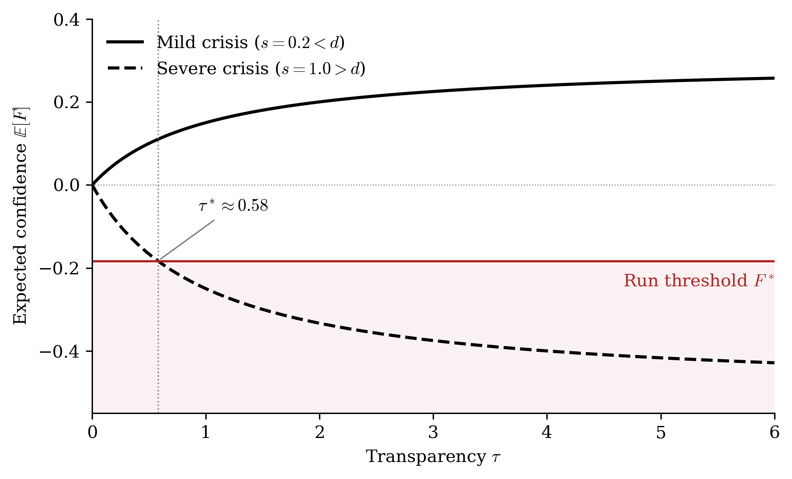

# Transparency, Confidence and Bank Runs

**A simple model with treasury implications** — companion code to the paper by Marco Fantin (MSc in Finance, HEC Lausanne, 2026).

Click the badge above to open the interactive model in your browser, with no installation required (the first launch may take a minute).

## The question

Is transparency a stabiliser or an accelerant in a banking crisis? Practitioners see disclosure as the foundation of depositor confidence, while part of the theoretical literature (Di Caprio and Santos-Arteaga, 2012) shows that imposing transparency can itself trigger a run. The model reconciles the two views:

- **Transparency amplifies what it reveals.** Depositors combine the bank's reputation with its disclosure; transparency sets the weight of the disclosure. It raises confidence when the crisis is milder than the bank's pre-crisis margin, and lowers it when the crisis exceeds that margin.
- **The depositor base decides how confidence becomes a run.** A homogeneous base makes a run less likely but sudden and total; a heterogeneous base makes it more likely but gradual.

## The model in brief

| Step | Equation |
|---|---|
| True soundness | $\theta = d - s$ |
| Disclosure | $y = \theta + \varepsilon,\ \varepsilon \sim \mathcal{N}(0, 1/\tau)$ |
| Confidence (Bayes) | $F = \frac{\tau}{1+\tau}\, y$ |
| Withdrawals | $w(F) = \lambda + (1-\lambda)\,\Phi\left(\frac{\bar c - F}{\sigma}\right)$ |
| Run threshold | $w(F^*) = \ell$ |

where $\tau$ is transparency, $s$ the crisis severity, $d$ the pre-crisis margin, $\ell$ the liquidity buffer, $\lambda$ the share of non-rational depositors, and $\bar c$, $\sigma$ the mean and dispersion of withdrawal thresholds.

## Repository contents

| File | Purpose |
|---|---|
| `model.py` | The model: one function per equation of the paper |
| `plotting.py` | The three dashboard panels, shared by the notebook and the desktop app |
| `bank_run_explorer.ipynb` | Interactive notebook with a slider for every parameter |
| `explorer.py` | The same dashboard as a desktop window |
| `paper_figures.py` | Reproduces the figures of the paper (PDF and PNG) |
| `figures/` | Figures used in the paper |

## Run locally (Anaconda)

All dependencies (numpy, scipy, matplotlib, pandas, ipywidgets) are included in the standard Anaconda distribution.

- **Jupyter:** open `bank_run_explorer.ipynb` and run all cells.
- **Terminal:** `python explorer.py` for the dashboard, `python paper_figures.py` for the figures.

All parameter values are illustrative and not calibrated to any specific bank.

## Reference

Di Caprio, D. and Santos-Arteaga, F. J. (2012). Financial transparency and bank runs. *Applied Mathematical Sciences*, 6(77), 3839–3844.

## License

Code released under the MIT License.
